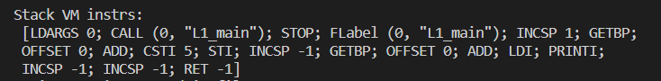

# 2020-21学年第2学期

## **实验报告**


- 课程名称: <u>编程语言原理与编译</u>
- 实验项目: <u>期末大作业</u>
- 专业班级: <u>计算机1901</u>
- 学生学号: <u>31901025</u>
- 学生姓名: <u>邵育华</u>
- 实验指导教师:  <u>郭鸣</u>
- 项目地址: [Github](https://github.com/Benjamin0713/Fsharp.git)

------

## 简介

这是一个基于MicroC实现的编译原理大作业。

在本次大作业中，从语法、词法、解释器和编译器等方面有逐步深入的了解，在解释器中实现的部分功能由于学习能力不足没有在编译器中充分实现。但是本人对已实现的功能，相对而言已有初步的熟知和理解；而编译原理作为一门对高级程序语言进行底层翻译理解的技术，这对于我们理解各种程序语言背后运行的逻辑过程相当重要。

## 文件结构

* 前端：由`F#`语言编写
  * `Absyn.fs`: 抽象语法书结构的定义
  * `CLex.fsl`: 词法定义
    * `CLex.fs`:生成的词法分析器
  * `CPar.fsy`:语法定义
    * `CPar.fs`:生成的语法分析器
  * `interp.fs`:解释器
  * `comp.fs`:编译器
  * `Machine.fs`:栈式虚拟机指令的定义及将其转化为机器指令序列
* 编译器后端：
  * `machine.c`:栈式虚拟机，C语言编写
* 测试集文件：`myexample`文件夹

## 使用方法

### 解释器

```sh
dotnet restore  interpc.fsproj   # 可选
dotnet clean  interpc.fsproj     # 可选
dotnet build -v n interpc.fsproj # 构建./bin/Debug/net6.0/interpc.exe ，-v n查看详细生成过程

# 执行解释器
./bin/Debug/net6.0/interpc.exe example/ex1.c 8
dotnet run --project interpc.fsproj example/ex1.c 8
dotnet run --project interpc.fsproj -g example/ex1.c 8  # 显示token AST 等调试信息
```

### 编译器

```sh
dotnet restore  microc.fsproj # 可选
dotnet clean  microc.fsproj   # 可选
dotnet build  microc.fsproj   # 构建 ./bin/Debug/net6.0/microc.exe

dotnet run --project microc.fsproj example/ex1.c    # 执行编译器，编译 ex1.c，并输出  ex1.out 文件
dotnet run --project microc.fsproj -g example/ex1.c   # -g 查看调试信息
```

### 虚拟机

```sh
# 编译 c 虚拟机
gcc -o machine.exe machine.c

# 虚拟机执行指令
machine.exe ./example/ex9.out 3

# 调试执行指令
machine.exe -trace ./example/ex9.out 0  # -trace  并查看跟踪信息
machine.exe -trace ./example/ex9.out 3
```

### 功能列表

**本次大作业实现了如下功能**

* 词法
  * `//`、`/* */`、`(* *)`注释表示
* 语法
  * 三目运算符`?:`
  * 变量初始化并赋值`int`
  * `do while/for/do until`实现
* 特性
  * 布尔类型`bool`、浮点类型`float`
  * 自增自减运算符`++`、`--`
  * 复合赋值运算符`+=、-=、/=、*=、%=`
  * `Max、Min、Abs`函数
  * 位运算`&、|、^、~、<<、>>`

## 功能实现

### **词法功能**

* **`//`、`/* */`、`(* *)`注释表示**

* 测试用例`myex8.c`

  ```c
  void main() { //注释修改
      int i ;
      i = 5;
      (*i = 10;*)
      // i = 10;
      /* i += 1;
         i += 3*/
      print i;
  }
  ```

* 测试结果

  * 解释器

    

  * 编译器

    

  * 中间`AST`生成

    

  * 编译指令序列

### **语法功能**

* **变量初始化并赋值`int`**

* 测试用例`myex11.c`

  ```c
  void main(){ //变量初始化并赋值
      int i = 1;
      print i;
  }
  ```

* 测试结果

  * 解释器

    

  * 编译器

    

  * 中间`AST`生成

    

  * 编译指令序列

    

* **三目运算符`?:`**

* 测试用例`myex2.c`

  ```c
  void main(int n)
  { //三目运算
      print n;
      n = n==8?1:0;
      print n;
  }
  ```

* 测试结果

  * 解释器

    

  * 编译器

    

  * 中间`AST`生成

    

  * 编译指令序列

    

* **`for`循环**

* 测试用例`myex7.c`

  ```c
  void main(){//for循环
  	int i;
  	for(i=0;i<10;++i) {
          print i;
          }
  }
  ```

* 测试结果

  * 解释器

    

  * 编译器

    

  * 中间`AST`生成

    

  * 编译指令序列

    

* **`do while`循环**

* 测试用例`myex9.c`

  ```c
  void main(int n ) {//dowhile循环
     int i ;
     i = 0;
     do {
         print i;
         i += 1;
     }while(i < n);
  }
  ```

* 测试结果

  * 解释器

    

  * 编译器

    

  * 中间`AST`生成

    

  * 编译指令序列

    

* **`do until`循环**

* 测试用例`myex11.c`

  ```c
  void main() {//dountil循环
      int i ;
      i = 5;
      do {
          print i;
          i--;
      }until(i == 0);
  }
  ```

* 测试结果

  * 解释器

    

  * 中间`AST`生成

    

### **特性**

* **自增自减运算符`++`、`--`**

* 测试用例`myex1.c`

  ```c
  void main(int n) { //自增自减
    print n;
    print ++n;
    print n;
  
    print n;
    print --n;
    print n;
  
    print n;
    print n++;
    print n;
  
    print n;
    print n--;
    print n;
  }
  ```

* 测试结果

  * 解释器

    

  * 编译器

    

  * 中间`AST`生成

    

  * 编译指令序列

    

* **复合赋值运算符`+=、-=、/=、*=、%=`**

* 测试用例`myex3.c`

  ```c
  void main(int n) { //复合赋值
      print n;
      n += 2;
      print n;
      n -= 2;
      print n;
      n *= 2;
      print n;
      n /= 2;
      print n;
      n %= 2;
      print n;
  }
  ```

* 测试结果

  * 解释器

    

  * 编译器

    

  * 中间`AST`生成

    ​	

  * 编译指令序列

    

* **布尔类型`bool`**

* 测试用例`myex14.c`

  ```c
  void main() {
  	bool b = true;
  	bool c = false;
  
  	print b;
  	print c;
  }
  ```

* 测试结果

  * 解释器

    

  * 编译器

    

  * 中间`AST`生成

    

  * 编译指令序列

    

* **`Max、Min`函数**

* 测试用例`myex5.c`

  ```c
  void main() {//max\min函数
      int i ;
      i = 5;
      int j ;
      j = 9;
      int k ;
      k = Max(i, j);
      print k;
      int k1 ;
      k1 = Min(i, j);
      print k1;
  }
  ```

* 测试结果

  * 解释器

    

  * 编译器

    

  * 中间`AST`生成

    

  * 编译指令序列

    

* **浮点类型`float`**

* 测试用例`myex4.c`

  ```c
  void main(){ //float类型 有问题没完全实现
      float f;
      f = 7.13;
      print f;
  }
  ```

* 测试结果

  * 解释器

    

  * 中间`AST`生成

    

* **`Abs`函数**

* 测试用例`myex6.c`

  ```c
  void main(){
      int i;
      i = -9;
      print i;
      int j;
      j = Abs(i);
      print j;
  }
  ```

* 测试结果

  * 解释器

    

  * 中间`AST`生成

    

* **位运算`&、|、^、~、<<、>>`**

* 测试用例`myex13.c`

  ```c
  void main() { //位运算
  	int a;
  	int b;
  	int c;
  	a = 1;
  	b = 0;
  	c = a&b;
  	print c;
  	c = a|b;
  	print c;
  	c = a << 2;
  	print c;
  	c = c >> 1;
  	print c;
  	c = a ^ b;
  	print c;
  	c = ~b;
  	print c;
  }
  ```

* 测试结果

  * 解释器

    

  * 中间`AST`生成

    

## 项目分工介绍

| 姓名   | 学号     | 班级       | 任务 | 权重 |
| ------ | -------- | ---------- | ---- | ---- |
| 邵育华 | 31901025 | 计算机1901 | 全部 | 1.0  |

## Github日志


## 功能自评表（1⭐-5⭐）

| 功能                               | 解释器 | 编译器 | 自评  | 测试文件 |
| ---------------------------------- | ------ | ------ | ----- | -------- |
| **词法**                           |        |        |       |          |
| `//`、`/* */`、`(* *)`注释表示     | ✔      | ✔      | ⭐⭐⭐⭐⭐ | myex8.c  |
| **语法**                           |        |        |       |          |
| 三目运算符`?:`                     | ✔      | ✔      | ⭐⭐⭐⭐⭐ | myex2.c  |
| 变量初始化并赋值`int`              | ✔      | ✔      | ⭐⭐⭐⭐  | myex11.c |
| `do while`循环                     | ✔      | ✔      | ⭐⭐⭐⭐  | myex9.c  |
| `for`循环                          | ✔      | ✔      | ⭐⭐⭐⭐  | myex7.c  |
| `do until`循环                     | ✔      |        | ⭐⭐⭐   | myex10.c |
| **特性**                           |        |        |       |          |
| 布尔类型`bool`                     | ✔      | ✔      | ⭐⭐⭐⭐⭐ | myex14.c |
| 浮点类型`float`                    | ✔      |        | ⭐     | myex4.c  |
| 自增自减运算符`++`、`--`           | ✔      | ✔      | ⭐⭐⭐⭐⭐ | myex1.c  |
| 复合赋值运算符`+=、-=、/=、*=、%=` | ✔      | ✔      | ⭐⭐⭐⭐⭐ | myex3.c  |
| `Max、Min`函数                     | ✔      | ✔      | ⭐⭐⭐⭐  | myex5.c  |
| `Abs`函数                          | ✔      |        | ⭐⭐⭐   | myex6.c  |
| 位运算`&、|、^、~、<<、>>`         | ✔      |        | ⭐⭐⭐⭐  | myex13.c |

## 心得体会

* 邵育华：

  作为正在准备考研的大三学生，在大三下还面临着四门课的大作业，相对于其他三门课，编译原理对于我来说是一门从没有接触过的领域，在平时的课程里也有很多内容没有理解，以至于在最后做大作业的时候不知道从哪里入手。在和同学花一天时间研究了整个MicorC项目文件结构之后，对每个文件的功能有了初步了解后才逐步开始调试和功能添加，从自增自减到后面的循环，难度是循序渐进，解释器和编译器上我觉得编译器需要取理解栈帧的内容并一步步调试，感觉编译器是比较难的所以我自己实现的时候也遇到了很多困难。但是从这次大作业实践中也体会到了很多底层逻辑的实现，就比如自增的实现包括前置自增`++i`和后置自增`i++`，在逻辑上一个要先保存当前的存储里的值、一个只需要进行`add`，大作业中也帮助我回顾了很多平时课堂中没听懂的内容，这对我复习编译原理考试也有帮助。
  
* 课程建议：

  课程难度适中，就是需要花时间去理解每一个知识点；

  建议上课多提问，这样可以查询学生掌握情况；

  大作业可以中期检查，查看每个小组自己想要实现多少功能。
